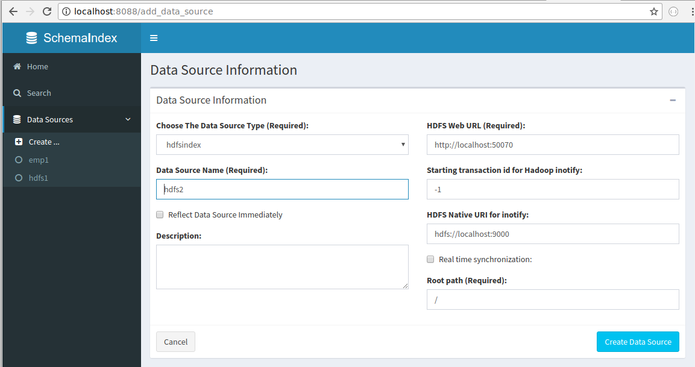
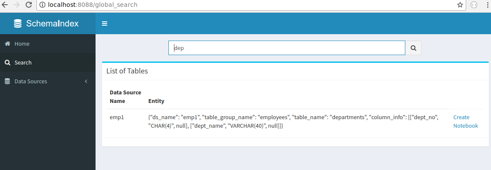

Overview
============
SchemaIndex is designed for data scientists to find data more efficiently. It can index the tables
and files known to the user.

With schemaindex, you can:

1. Create a data source (e.g. Mysql, Oracle, etc) by registering its connection information.

2. Reflect the data source and index the metadata.

3. Search for all tables/entities in those data sources by their names.

Supported Data Sources
-------------
* HDFS
* Mysql
* Sqlite

Data Sources to Support on Roadmap
-------------
* Oracle
*

Installation
============

On Linux
-------------
Stardard pip should be able to install schemaindex:

.. code-block:: bash

    $ pip install schemaindex

How to use
============

Basic Usage
-------------
To start the schemaindex server, please run this command:

.. code-block:: bash

    $ schemaindex runserver

The following is a sample output:

.. code-block:: bash

    (py3env1) duan:py3env1$ schemaindex runserver
    Server started, please visit : http://localhost:8088/

*runserver* command should boot up a webserver and also open a browser for you.
In the browser, click "datasources" and then click "create ..." to register your own data source.
For example, to register a new HDFS data source, you can input information like the following screenshot:

The next step is to reflect the data source and extract all metadata.
You can do so by clicking button "Relfect Now!" to extract the metadata of the data source,
 or check the box "Reflect Data Source Immediately" during data source creation.

If all previous two steps are successful, you should be able to search the files in "search" box
 appearing in "overview" and "search" page, like the following screenshot:

Work with HDFS Index
-------------
While creating data source, you can select 'hdfsindex' plugin. This plugin is based on hdfscli library (pip install hdfs).
You need to input those parameters:

1. HDFS Web URL: sometimes is also known as Namenode-UI. Note: Kerberos authentication is not supported. If you need it, please raise a ticket in github.

2. HDFS Native URL: Usually you can find this link after you openned the namenode-ui/web url. THis should start with hdfs://localhost:9000 (or 8020)

If you check "Real time synchronization:" and you have reflected the hdfs data source,
it will start a background java process to capture all hdfs changes and update the index in real time.
In background, you should be able to see a process similar to "java ... HdfsINotify2Restful".
If you do not see this process, try to restart schemaindex server, or look at the logs at $SCHEMAINDEX/log

Work with Databases
-------------
By default, schemaindex comes with a predefined plugin to extract metadata from mainstream databases. It is sqlalchemyindex.
This  reflect engine is based on python library Sqlalchemy, which works for many databases, including Mysql, Sqlite, etc.
For mysql to work, you need to install pymysql (python3) or mysql-python (python2) in advance.

How to start a SchemaIndex Server
-------------
All the plugins are located in $SCHEMAINDEX/plugin. Currently only HDFS and SQLALCHEMY are implemented.
If you want to add more plugins, you can put the plugin into this folder and run this command:

.. code-block:: bash

    $ schemaindex reload plugin

The following is a sample output:

.. code-block:: bash

    (py3env1) duan:py3env1$ schemaindex reload plugin
    Plugins are reloaded.
    Reflect Plugin Name:                     Path:
    hdfsindex                                /home/duan/virenv/py3env1/local/lib/python2.7/site-packages/schemaindex/plugin/hdfsindex
    sqlalchemy                               /home/duan/virenv/py3env1/local/lib/python2.7/site-packages/schemaindex/plugin/sqlalchemyindex

Reference
============

Those questions explain why I created this software:

1. `What is the best way to index and search files in HDFS? <https://www.quora.com/What-is-the-best-way-to-index-and-search-files-in-HDFS>`_

2. `Search/Find a file and file content in Hadoop <https://stackoverflow.com/questions/6297533/search-find-a-file-and-file-content-in-hadoop>`_

3. `find file in hadoop filesystem <https://stackoverflow.com/questions/42903113/find-file-in-hadoop-filesystem>`_

